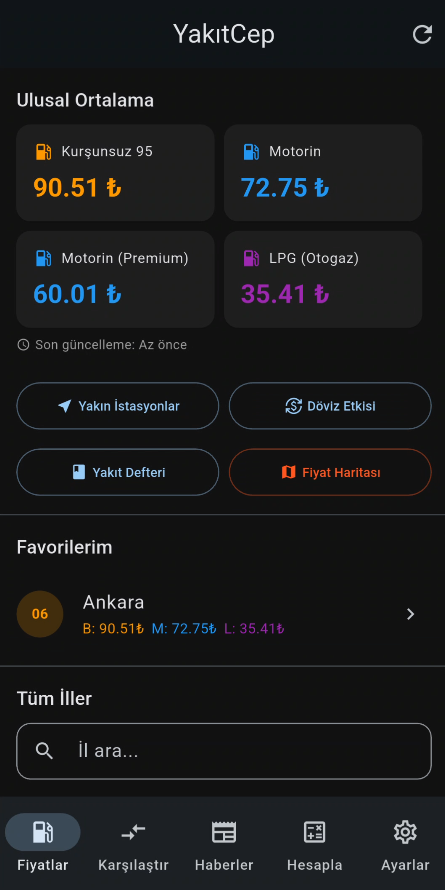
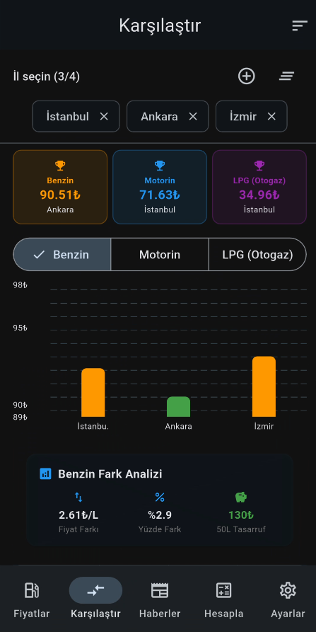
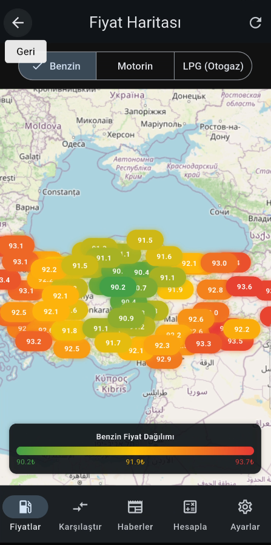
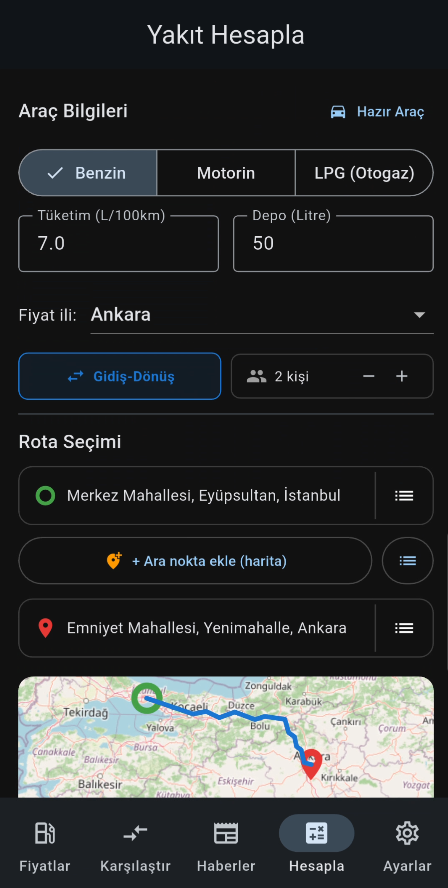
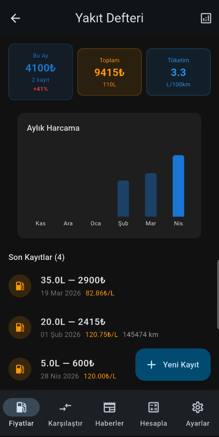
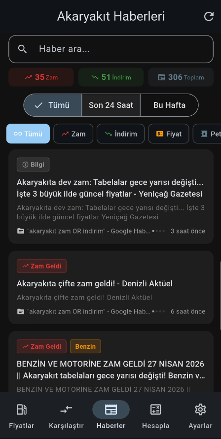

<div align="center">

# ⛽ YakıtCep

**Turkey's Open-Source Fuel Price Tracker**  
*Türkiye'nin Açık Kaynak Akaryakıt Fiyat Takip Uygulaması*

[](https://flutter.dev)
[](LICENSE)
[](https://github.com/BeratARPA/fuel_tr/releases)
[](https://www.epdk.gov.tr)

[📥 Download APK](https://github.com/BeratARPA/fuel_tr/releases/latest) · [🐛 Report Bug](https://github.com/BeratARPA/fuel_tr/issues) · [💡 Request Feature](https://github.com/BeratARPA/fuel_tr/issues)

</div>

---

## 📱 Screenshots

<!-- Add screenshots here after capturing them. Recommended order: -->
<!-- 1. Home (prices overview), 2. Province comparison, 3. Heat map, 4. Trip calculator, 5. Fuel logbook, 6. News feed -->

| Ana Sayfa | İl Karşılaştırma | Isı Haritası |
|:---------:|:----------------:|:------------:|
|  |  |  |

| Yol Maliyeti | Yakıt Defteri | Haberler |
|:------------:|:-------------:|:--------:|
|  |  |  |

---

## 🚀 Features / Özellikler

### 💰 Fuel Prices / Yakıt Fiyatları
- **Real-time prices** from EPDK (Turkey's official Energy Market Regulatory Authority) for all 81 provinces
- Benzin 95, Motorin (Diesel), and LPG/Otogaz prices
- **Price history charts** — track trends over the past 30 days
- **Turkey heat map** — instantly see which provinces have the cheapest fuel
- **Multi-province comparison** — compare up to 4 provinces side by side
- Favorite province pinning

### 🗺️ Nearby Stations / Yakınımdaki İstasyonlar
- Interactive map showing fuel stations near your current location
- Powered by OpenStreetMap

### 📊 Analysis & Calculators / Analiz ve Hesaplayıcılar
- **Trip cost calculator** — enter your route, vehicle consumption, and get exact cost estimates (split per passenger too)
- **OTV/KDV tax calculator** — see exactly how much of what you pay is tax vs. fuel margin
- **Currency & Brent oil impact** — live USD/TRY and Brent crude price correlation with pump prices

### 📓 Fuel Logbook / Yakıt Defteri
- Log every fill-up: date, liters, cost, odometer reading
- Monthly spending reports with comparative charts
- Multi-vehicle support — manage separate profiles for each car

### 📰 News Feed / Haberler
- Curated fuel & energy news from Turkish sources
- Search and time-based filtering

### 🔔 Notifications / Bildirimler
- Price change alerts for your favorite provinces
- Weekly fuel spending summary (every Sunday)
- News notifications

### 🏠 Home Screen Widget
- Android home screen widget showing your favorite province's current prices — always a glance away

### 🌐 Localization
- Full Turkish 🇹🇷 and English 🇬🇧 support

---

## 🛠️ Tech Stack

| Category | Library |
|----------|---------|
| State Management | [Riverpod 2.6](https://riverpod.dev) |
| Navigation | [GoRouter 14](https://pub.dev/packages/go_router) |
| Charts | [fl_chart 0.69](https://pub.dev/packages/fl_chart) |
| Maps | [FlutterMap 8](https://pub.dev/packages/flutter_map) |
| Background Tasks | [WorkManager](https://pub.dev/packages/workmanager) |
| Notifications | [flutter_local_notifications](https://pub.dev/packages/flutter_local_notifications) |
| Local Storage | [SharedPreferences](https://pub.dev/packages/shared_preferences) |
| Ads | [Google Mobile Ads](https://pub.dev/packages/google_mobile_ads) |

---

## 📡 Data Sources

| Source | Usage |
|--------|-------|
| [EPDK](https://www.epdk.gov.tr) | Official Turkey fuel price data |
| [OpenStreetMap Overpass API](https://overpass-api.de) | Nearby fuel station locations |
| [OSRM](https://project-osrm.org) | Route distance calculation |
| Exchange Rate API | Live USD/TRY rates |
| Brent Crude API | Oil price tracking |

---

## 📥 Installation

### Option 1 — Download APK (Recommended)
1. Go to [**Releases**](https://github.com/BeratARPA/fuel_tr/releases/latest)
2. Download `yakitcep-vX.X.X.apk`
3. Enable "Install from unknown sources" on your Android device
4. Install and enjoy!

### Option 2 — Build from Source

**Requirements:**
- [Flutter SDK](https://docs.flutter.dev/get-started/install) ≥ 3.0.0
- Android SDK / Android Studio

```bash
# Clone the repo
git clone https://github.com/BeratARPA/fuel_tr.git
cd fuel_tr

# Install dependencies
flutter pub get

# Run in debug mode
flutter run

# Build release APK
flutter build apk --release
```

---

## 🤝 Contributing

Contributions are welcome! Feel free to open an issue or submit a pull request.

1. Fork the repo
2. Create your feature branch (`git checkout -b feature/amazing-feature`)
3. Commit your changes (`git commit -m 'Add amazing feature'`)
4. Push to the branch (`git push origin feature/amazing-feature`)
5. Open a Pull Request

---

## 📄 License

This project is licensed under the **MIT License** — see [LICENSE](LICENSE) for details.

---

## 👨‍💻 Author

**Berat** — [@BeratARPA](https://github.com/BeratARPA)

---

<div align="center">

*Made with ❤️ for Turkish drivers dealing with ever-changing fuel prices.*

⭐ Star this repo if you find it useful!

</div>
